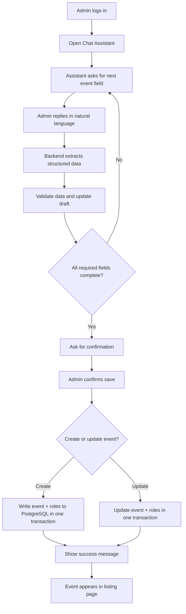

# Architecture Event AI

## Title Page

**Project Title:** Chat-Based Event Management System  
**Document Title:** Architecture Event AI  
**Prepared For:** Project Submission  
**Prepared By:** Season Banjade
---

## Abstract

This document presents the architecture, conversation flow, localization strategy, intelligence layer, security considerations, deployment approach, and implementation trade-offs of a chat-based event management system. The application enables authenticated administrative users to create and update structured event records through natural conversation rather than through conventional forms. The final event data is persisted in PostgreSQL and surfaced through a role-aware event listing interface.

---

## 1. System Overview

The proposed system is a conversational event management platform designed primarily for administrative use. It allows an administrator to create and update event records through guided dialogue with an AI assistant, replacing the conventional form-based workflow with a more natural interaction model. The completed event is stored in PostgreSQL and displayed in the event listing interface.

The operational flow is summarized as follows:

1. The administrator authenticates into the system.
2. The administrator opens the chat-based assistant.
3. The assistant requests one event attribute at a time.
4. The administrator responds using natural language.
5. The backend extracts structured information from the response.
6. The system validates the extracted values.
7. The draft event is updated in the active chat session.
8. The administrator explicitly confirms the action.
9. The event is committed to the database.
10. The saved event appears in the event listing page.

The implementation is based on the following technologies:

- Node.js for backend services
- React for the frontend administrative interface
- PostgreSQL for persistent storage
- JWT for authentication and authorization
- an AI model for conversational interpretation
- Docker for reproducible local deployment

---

## 2. Architecture Decisions

### 2.1 Chat-First, Not Form-First

The biggest design choice was to keep event creation conversational. Instead of building a long form with many required fields, the assistant asks for each field step by step. This better matches the requirement and makes the interface easier for admin users.

### 2.2 Separate Responsibilities by Layer

The codebase is split into clear layers:

- controllers handle HTTP requests and orchestration
- repositories handle database access
- services handle AI parsing, validation, and business rules
- middleware handles auth, logging, and request validation
- React components handle UI rendering and session state

This separation also supports backend decoupling and makes the system easier to extend and test.

### 2.3 PostgreSQL as the Source of Truth

The final structured event is stored in PostgreSQL, not only in chat session memory. The chat session holds the draft state, but the database is the real persisted record.

### 2.3.1 Chat Session Persistence in the Database

The same approach is used for chat sessions. The application stores active chat sessions in PostgreSQL instead of relying only on JSON file storage.

This design was chosen because database-backed sessions are:

- more reliable across restarts
- safer for multi-user usage
- easier to query and expire
- better aligned with the rest of the application data model
- easier to manage in Docker and production environments

The repository still contains a file-fallback mechanism for local development, but the database is the primary storage path. That is preferable because it keeps the conversational state consistent with the rest of the system and avoids losing drafts if the application restarts.

### 2.4 Role-Based Access Control

Admins can create and manage events. Other roles can view only events that match their visibility rules. The event listing is filtered by role and ownership.

### 2.5 Shared Event Metadata

The event field definitions are centralized so the AI prompt, validation logic, and UI labels stay aligned. This avoids drift between the chat assistant and the frontend.

The same design principle is used for other static values such as roles, routes, and validation rules by storing them in constants instead of repeating hardcoded values across files.

### 2.6 Atomic Event Save

Event creation and role assignment are written as a single transaction so the app does not end up with a partially created event.

### 2.7 Reusable Modules and DRY Helpers

The frontend uses reusable form and layout components, while the backend uses shared helper functions for common tasks such as draft normalization, validation, and repeated SQL shapes. This follows the DRY principle and reduces maintenance overhead.

### 2.8 Duplicate Event Protection

The backend checks for equivalent events before creation so the same event cannot be submitted multiple times with identical details.

---

## 3. Implementation Notes

The implementation details are intentionally distributed across the relevant sections of this document:

- architecture-related items are described in Section 2
- conversational behavior is described in Section 4
- localization behavior is described in Section 5
- AI model behavior is described in Section 6
- security-related items are described in Section 7
- deployment and environment configuration are described in Section 8

---

## 4. Conversation Design

### 4.1 Step-by-Step Flow

The assistant collects fields in a guided sequence:

1. event name
2. subheading
3. description
4. banner image URL
5. time zone
6. status
7. start date and time
8. end date and time
9. vanish date and time
10. roles

### 4.2 Not Form-Like

The assistant does not ask the user to fill a rigid screen full of inputs. Instead, it responds in a natural conversation style and uses quick replies where helpful.

### 4.3 Correction Support

The conversation allows edits such as:

- change start time
- update roles
- change the status
- modify the description

This is important because event creation is often iterative.

### 4.4 Confirmation Gate

When all required fields are complete, the assistant asks for confirmation before saving. That prevents accidental commits and makes the final action explicit.

### 4.5 Context Persistence

Each chat session stores the current draft and conversation history so the admin can refresh the page and continue without losing the in-progress event.

---

## 5. Localization Approach

### 5.1 Language Detection

The system detects language from the user message and stores it in the session draft.

### 5.2 Response in Same Language

The assistant replies in the detected language so the conversation feels natural to the user.

### 5.3 Stored Event Language

The event record also stores the language used in the conversation so the saved content remains consistent with the user's input language.

### 5.4 Supported Languages

The current implementation supports at least:

- English
- Spanish
- French

### 5.5 Localized Date and Role Understanding

The conversational parser supports common language variants for:

- weekdays
- relative dates like next Monday
- timezone names
- role names

This makes the system more flexible for real users.

---

## 6. Intelligence Implementation

### 6.1 AI Role in the System

The AI model is used to understand natural language and extract structured event data from the user's message.

The backend currently integrates with OpenRouter as the model access layer. It reads the API key from `OPENROUTER_API_KEY` and uses `OPENROUTER_MODEL` when provided, falling back to `openrouter/auto` by default.

### 6.2 What the Model Does

The model helps with:

- intent detection
- field extraction
- correction handling
- multilingual interpretation
- conversation continuation

The model family may vary depending on the OpenRouter route selected at runtime, but the application does not call Gemini directly. It always communicates through the OpenRouter API endpoint.

### 6.3 What the Backend Still Controls

The model is not trusted as the only source of truth. The backend still validates:

- required fields
- allowed status values
- valid role names
- time ordering
- banner URL format
- duplicate event detection

### 6.4 Deterministic Validation

AI output is normalized and then validated with application rules. This hybrid approach keeps the system flexible without sacrificing correctness.

### 6.5 Confirmation-Aware Save Logic

The backend waits until the draft is complete and the user confirms before committing the event to the database.

---

## 7. Security Considerations

### 7.1 JWT Authentication

All protected routes use JWT-based authentication. The login process returns a token, and protected endpoints verify that token before allowing access.

### 7.2 Role Authorization

Only admins can create, update, and delete events. The admin user-management page is also restricted to admins.

### 7.3 Input Validation

The backend validates incoming data before it reaches the database. This includes:

- email format
- password requirements
- event field presence
- date consistency
- valid role values

Where appropriate, validation is case-insensitive so users can type natural variants without breaking the flow.

### 7.4 SQL Injection Prevention

Database queries use parameterized SQL placeholders instead of string concatenation. This helps prevent SQL injection attacks.

### 7.5 Idempotency Implementation

The backend uses idempotency keys to protect repeated event creation requests from being processed more than once.

### 7.6 Cross-Origin Policy

CORS is configured to allow the intended frontend origin while preventing unnecessary cross-origin access.

### 7.7 Session Ownership Checks

Chat sessions are tied to a specific authenticated user. A user cannot access or modify another user's chat session.

### 7.8 Logging and Request Timing

The request logger captures request and response details, measures API duration, and redacts sensitive values like passwords and tokens.

### 7.9 Transaction Safety

Event creation and role assignment are committed together in a transaction. That prevents partial database state.

### 7.10 Password Encryption

User passwords are never stored in plain text. They are hashed before being written to the database, which protects account credentials if the database is exposed.

### 7.11 Duplicate Event Validation

Before saving a new event, the backend checks whether an equivalent event already exists for the same user. This prevents repeated submissions from creating duplicate records.

---

## 8. Deployment Approach

### 8.1 Local Development

The project is designed to run locally with:

- backend Node.js server
- frontend React app
- PostgreSQL database

### 8.2 Docker Support

Docker is used for repeatable local setup and database initialization. This makes it easier to run the same project environment on another machine.

### 8.3 Environment-Based Configuration

Important settings are moved into environment variables, including:

- database connection details
- JWT secrets
- API base URLs
- AI provider keys

### 8.4 HTTPS Awareness

The production-oriented deployment approach assumes HTTPS so credentials, tokens, and chat traffic are protected in transit.

### 8.5 Suggested Production Deployment

A practical production deployment would use:

- React frontend on a static host or CDN
- Node.js backend on a managed app platform
- PostgreSQL on a managed database service
- object storage or a file hosting service if image uploads are added later

---

## 9. Trade-offs and Limitations

### 9.1 Direct URL Banner Image Support

The current project supports banner image URLs, which is simpler than a full upload pipeline. This keeps the implementation lighter, but it means the user must provide a direct image link.

### 9.2 Confirmation Still Depends on Chat Wording

The save/commit step is guided by the assistant and confirmation phrases. This is flexible, but not as strict as a fixed form workflow.

### 9.3 AI Interpretation Is Not Perfect

Natural language understanding can still misread ambiguous input. Validation reduces errors, but some edge cases still require correction.

### 9.4 Limited Language Support

The project supports a few languages, but it is not a full global localization platform.

### 9.5 Screenshots and Demo Scripts Are Test-Oriented

The screenshot automation uses hardcoded demo credentials and example content. That is acceptable for documentation, but it is not production logic.

### 9.6 Shared Constants and Reusable Utilities

The project uses centralized constants and generic helper methods to reduce duplication. This improves maintainability, although it requires discipline to keep shared modules aligned with the rest of the codebase.

---

## 10. Challenges and Improvements

### 10.1 Challenges Encountered

- keeping the chat draft in sync with database state
- preventing blank screens when session data is missing
- handling save confirmation without accidental commits
- ensuring role-based visibility stays consistent
- keeping AI output structured enough for validation

### 10.2 Improvements Made

- centralized event field metadata
- added better session recovery
- improved user-friendly assistant messages
- added admin user management and password reset
- added transaction-backed event save/update
- cleaned unused code and duplicated constants

### 10.3 Future Improvements

- richer banner handling
- stronger multilingual coverage
- better analytics and reporting
- more advanced event lifecycle tools
- optional notification workflows
- better admin activity auditing

---

## 11. User Flow Chart

---

## 12. Summary

This project employs a hybrid architecture in which AI is responsible for understanding conversational input, while deterministic backend logic preserves data correctness and system integrity. PostgreSQL serves as the system of record, React provides the interactive user interface, and JWT-based access control ensures that sensitive operations remain restricted to authorized users.

This combination enables a natural conversational experience without compromising validation, access control, or persistence guarantees.

