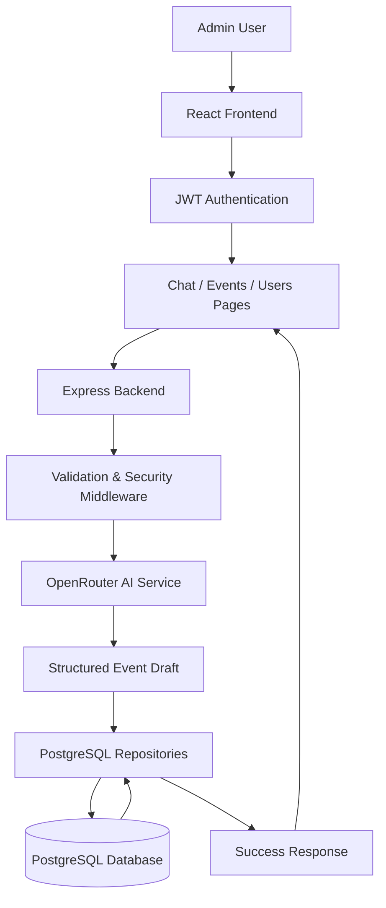

# Architecture Flow Chart

## Simple View

---

## Short Explanation

1. The admin logs in through the React frontend.
2. The frontend stores the JWT token and uses it for protected requests.
3. The user interacts with the chat page, events page, or user management page.
4. The backend validates the request and applies security checks.
5. The chat controller sends the message to the OpenRouter AI service.
6. The AI converts natural language into structured event data.
7. The repositories store the event data in PostgreSQL.
8. The backend returns a success response to the frontend.
9. The frontend updates the interface and shows the saved result.

---

## Purpose of the Diagram

This version is intended for quick presentation use. It shows the main system flow without extra implementation detail, while still reflecting the actual project architecture.

