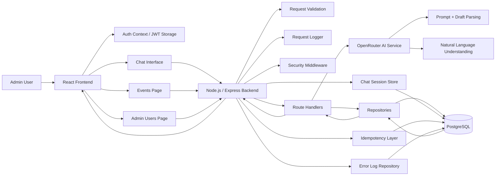

# Architecture Flow Chart

## Overview

This document provides a high-level architecture flow chart for the chat-based event management system. It shows how a user request moves through the frontend, backend, AI layer, validation logic, and PostgreSQL database.

---

## Architecture Flow Diagram

---

## Flow Explanation

### 1. User Interface Layer

The admin interacts with the React frontend. The UI contains:

- login and registration screens
- chat-based event creation page
- event listing page
- admin user management page

### 2. Authentication Layer

After login, the frontend stores the JWT token and user profile in browser storage. The token is used for protected API calls.

### 3. API and Middleware Layer

Every protected request passes through backend middleware such as:

- JWT verification
- role authorization
- request validation
- security headers
- request logging

### 4. Conversational Intelligence Layer

The chat controller forwards the user message to the OpenRouter-backed AI service. The AI service:

- interprets natural language
- extracts event fields
- preserves conversation context
- returns structured data and a human-friendly reply

### 5. Validation and Business Logic Layer

The backend validates the AI output and applies business rules such as:

- required event fields
- date consistency
- allowed roles
- status values
- duplicate event detection

### 6. Data Persistence Layer

Repositories store and retrieve data from PostgreSQL for:

- users
- roles
- events
- event-role mappings
- chat sessions
- idempotency keys
- error logs

### 7. Transaction Handling

Event creation and event updates are performed atomically so the event row and role mappings are committed together.

---

## Data Flow Summary

1. The admin enters a message in the chat UI.
2. The frontend sends the message to the backend API.
3. The backend validates the request and loads the current session draft.
4. The AI model extracts event data from the message.
5. The backend normalizes and validates the structured output.
6. If the event is complete, the user confirms the save.
7. The backend writes the event and roles to PostgreSQL.
8. The frontend receives the updated state or success response.
9. The event becomes visible in the event list page.

---

## Why This Architecture Was Chosen

This architecture was selected because it balances:

- user-friendly interaction
- clear separation of concerns
- AI-assisted input processing
- deterministic backend validation
- secure access control
- reliable database persistence

It is simple enough to maintain while still supporting the conversational workflow required by the project brief.

