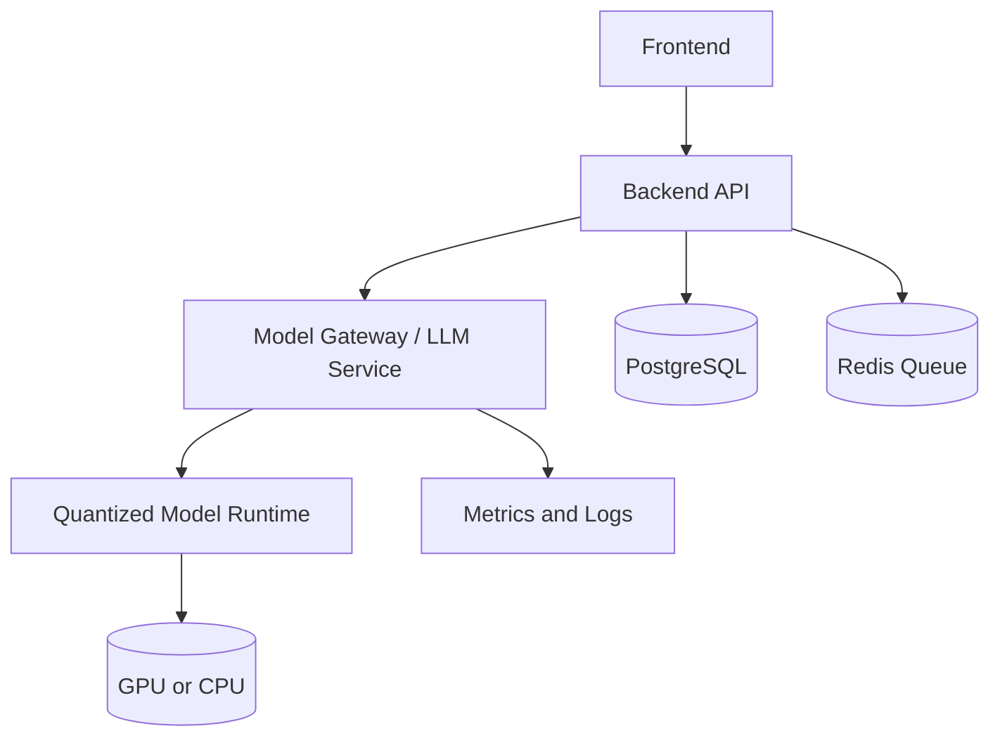
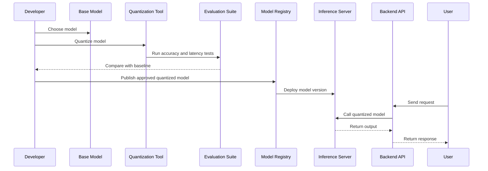
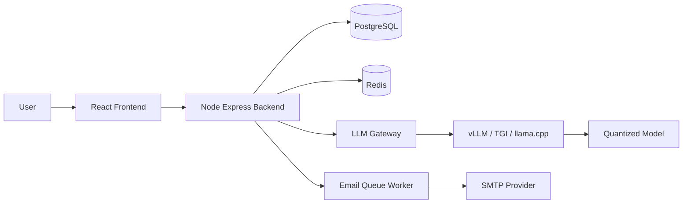
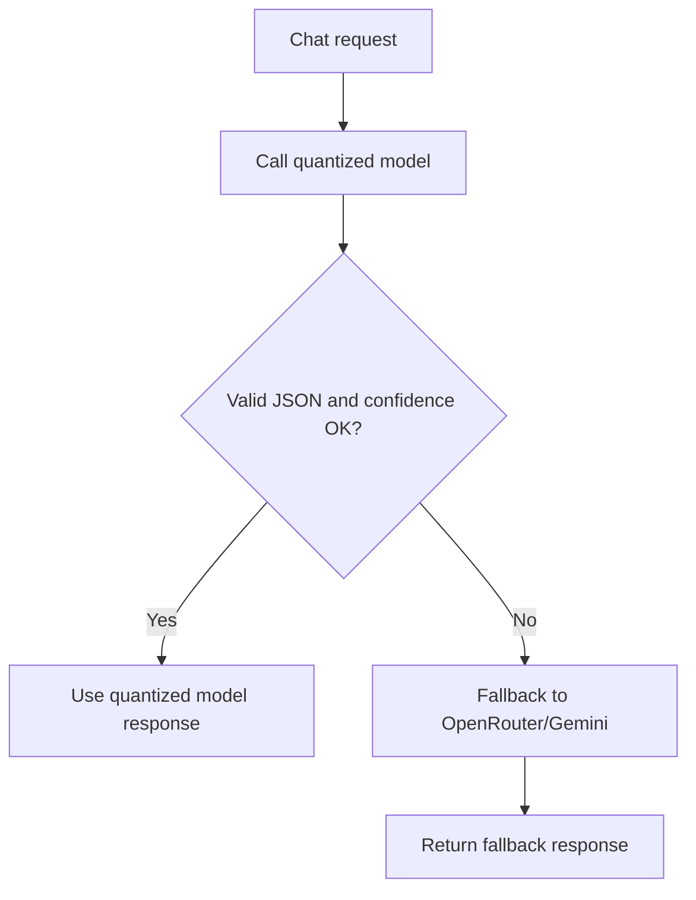

# Model Quantization In Production

This document explains what model quantization is, when to use it, how it works in production, and how it applies to this project.

## Quick Answer

If you are using hosted APIs like:

```text
OpenRouter
Gemini
OpenAI
Anthropic
```

you cannot directly quantize the model yourself. The model is hosted by the provider, and the provider controls its weights, precision, serving hardware, and optimization.

You can do model quantization only when you self-host the model, for example:

```text
Llama
Mistral
Qwen
Gemma
Phi
Whisper
BERT
custom fine-tuned models
```

In this project, the current backend calls an external LLM provider through `backend/services/openaiService.js`, so production quantization would apply only if you replace the hosted provider with a self-hosted model service.

## What Is Quantization?

Quantization reduces the numerical precision of model weights and sometimes activations.

Large models are normally trained using high precision formats such as:

```text
FP32  32-bit floating point
FP16  16-bit floating point
BF16  16-bit brain floating point
```

Quantization converts them to lower precision formats such as:

```text
INT8   8-bit integer
INT4   4-bit integer
NF4    4-bit normal float
GPTQ   4-bit post-training quantization
AWQ    Activation-aware weight quantization
GGUF   llama.cpp quantized model format
```

The goal is to reduce:

```text
model size
GPU memory usage
CPU memory usage
inference cost
latency
```

while keeping output quality acceptable.

## Simple Example

A model weight might originally be stored like this:

```text
0.18392745
```

In FP32, this uses 32 bits.

After quantization, it may be represented with fewer bits, for example 8-bit or 4-bit. The value becomes less exact, but the model becomes much smaller and faster to serve.

## Why Use Quantization In Production?

Quantization is useful when:

- GPU memory is limited.
- You want to serve larger models on smaller hardware.
- You want lower inference cost.
- You need faster response time.
- You want to run models on CPU or edge devices.
- You want higher throughput from the same hardware.

Example:

```text
13B model in FP16 may need around 26GB+ VRAM.
13B model in 4-bit may run in around 8GB to 10GB VRAM.
```

Exact memory depends on context length, batch size, runtime, KV cache, and quantization format.

## Types Of Quantization

### 1. Post-Training Quantization

This is the most common production approach.

You take an already-trained model and convert it to lower precision without retraining.

Examples:

```text
FP16 -> INT8
FP16 -> INT4
FP16 -> GGUF Q4_K_M
FP16 -> GPTQ 4-bit
FP16 -> AWQ 4-bit
```

Advantages:

- Fast to apply.
- No training dataset required in simple cases.
- Good for production inference.

Disadvantages:

- Some quality loss is possible.
- Needs evaluation before deployment.

### 2. Quantization-Aware Training

The model is trained or fine-tuned while simulating lower precision.

Advantages:

- Better accuracy than simple post-training quantization.
- Useful for high-stakes or very small models.

Disadvantages:

- More expensive.
- Requires training pipeline and data.
- More complex to operate.

### 3. Dynamic Quantization

Weights are quantized, but activations may be quantized dynamically during inference.

Common in CPU inference for smaller transformer models.

### 4. Static Quantization

Weights and activations are quantized using calibration data.

Common for computer vision, speech, and smaller NLP models.

## Common Quantization Formats For LLMs

| Format | Typical Use | Notes |
|---|---|---|
| INT8 | Safer quality, moderate compression | Good first production step |
| INT4 | Strong compression | More quality risk |
| NF4 | Fine-tuning and QLoRA | Common in training/fine-tuning workflows |
| GPTQ | GPU inference | Good for quantized LLM serving |
| AWQ | GPU inference | Often strong quality/performance balance |
| GGUF | llama.cpp / CPU / local inference | Great for local and edge deployment |

## Production Architecture With Quantized Model



In this architecture, the backend does not load the model directly. Instead, it calls a separate model service.

That service can run:

```text
vLLM
Text Generation Inference
llama.cpp server
Ollama
TensorRT-LLM
ONNX Runtime
TorchServe
custom FastAPI service
```

## Recommended Production Flow



## Step-By-Step Production Process

### Step 1: Decide If You Need Quantization

Ask:

```text
Are provider API costs too high?
Is latency too high?
Do we need offline/private deployment?
Do we need control over model weights?
Do we have GPU/CPU resources to self-host?
```

If you are happy with OpenRouter/Gemini quality, cost, and latency, you may not need quantization.

### Step 2: Choose A Self-Hosted Model

Examples:

```text
Qwen2.5 / Qwen3
Llama 3.x
Mistral
Gemma
Phi
```

Choose based on:

- Task quality
- License
- Model size
- Context length
- Hardware requirements
- Supported quantization formats

### Step 3: Choose Quantization Level

General rule:

```text
FP16/BF16 = best quality, highest cost
INT8      = good balance, low quality loss
INT4      = cheapest, more quality risk
```

For production, start with:

```text
INT8 for safety
AWQ 4-bit or GPTQ 4-bit for LLM cost reduction
GGUF Q4_K_M for llama.cpp-style local serving
```

### Step 4: Quantize The Model

Typical tools:

```text
AutoGPTQ
AutoAWQ
llama.cpp conversion tools
bitsandbytes
Optimum / ONNX Runtime
TensorRT-LLM
Hugging Face Transformers
```

Example conceptual commands:

```bash
# Example only: exact command depends on model/tool
python quantize.py \
  --model Qwen/Qwen2.5-7B-Instruct \
  --bits 4 \
  --format awq \
  --output ./models/qwen-7b-awq
```

For GGUF-style local inference:

```bash
# Example only
python convert_hf_to_gguf.py ./model --outfile model-f16.gguf
llama-quantize model-f16.gguf model-q4_k_m.gguf Q4_K_M
```

### Step 5: Evaluate Quality

Do not deploy quantized models without evaluation.

Compare:

```text
base model output
quantized model output
latency
token throughput
memory usage
failure cases
JSON formatting reliability
hallucination rate
business task success
```

For this project, test prompts like:

```text
Create event with name, subheading, description, timezone, start time, end time, vanish time, status, and roles.
Update event start time.
Change roles to Admin and Manager.
Confirm event creation.
Respond in German/French if language is selected.
```

Important because your chat system expects structured JSON from the model.

### Step 6: Deploy Behind A Stable API

Do not tightly couple the backend to one model runtime.

Use a small model gateway:

```text
backend/services/openaiService.js
        ↓
internal LLM gateway endpoint
        ↓
vLLM / TGI / llama.cpp / Ollama
        ↓
quantized model
```

This lets you switch models without rewriting application logic.

## Example Self-Hosted Setup

### Option A: vLLM

Good for high-throughput GPU inference.

```text
Backend API -> vLLM OpenAI-compatible server -> quantized model
```

Benefits:

- OpenAI-compatible API
- Good batching
- Good throughput
- Production-friendly

### Option B: llama.cpp Server

Good for GGUF models and smaller deployments.

```text
Backend API -> llama.cpp server -> GGUF quantized model
```

Benefits:

- Runs on CPU or GPU
- Simple local deployment
- Very popular for quantized models

### Option C: Ollama

Good for local development or simple internal deployment.

```text
Backend API -> Ollama -> quantized model
```

Benefits:

- Easy model management
- Simple API
- Good for demos and development

## How This Applies To This Project

Current flow:

```text
backend/services/openaiService.js
→ OpenRouter or Gemini API
→ hosted model
```

Current `.env` example:

```env
LLM_PROVIDER=openrouter
OPENROUTER_MODEL=openrouter/auto
OPENROUTER_API_KEY=...
```

Because OpenRouter hosts the model, you cannot quantize that model yourself.

To use quantization in production, change the architecture to:

```text
backend/services/openaiService.js
→ self-hosted model endpoint
→ quantized model runtime
```

Example future `.env`:

```env
LLM_PROVIDER=selfhosted
SELF_HOSTED_LLM_URL=http://llm-service:8000/v1/chat/completions
SELF_HOSTED_LLM_MODEL=qwen-7b-awq
LLM_TIMEOUT_MS=30000
LLM_TEMPERATURE=0.7
```

Then update `openaiService.js` to call your self-hosted endpoint.

## Production Deployment Diagram



## Monitoring In Production

Track:

```text
request latency
tokens per second
GPU memory usage
CPU memory usage
queue time
error rate
timeout rate
JSON parse failure rate
model fallback rate
cost per request
```

For this project, especially track:

```text
structured response parse failures
invalid event data
missing roles
bad date/time extraction
language mismatch
chat confirmation failure
```

## Risks Of Quantization

Quantization can cause:

- Lower reasoning quality
- More formatting mistakes
- Worse JSON reliability
- More hallucinations
- Weak multilingual output
- Date/time extraction errors
- Smaller instruction-following margin

This matters because your app asks the LLM to produce strict event metadata.

## Safe Rollout Strategy

Use gradual rollout:

```text
1. Keep hosted OpenRouter/Gemini as baseline.
2. Deploy self-hosted quantized model internally.
3. Mirror a small percentage of prompts to the quantized model.
4. Compare output quality offline.
5. Enable for admin-only testing.
6. Enable for 10% traffic.
7. Increase gradually if metrics are healthy.
8. Keep fallback to hosted model.
```

## Fallback Strategy

Recommended:



Fallback conditions:

```text
model timeout
invalid JSON
missing required fields
low confidence
unsupported language
repeated clarification
server overloaded
```

## Best Practices

- Do not quantize blindly.
- Always compare against a baseline model.
- Keep production fallback.
- Use a model gateway abstraction.
- Version every model artifact.
- Log model name, quantization type, and response quality.
- Keep prompts short and structured.
- Validate model output before saving to DB.
- Prefer INT8 first if quality is critical.
- Use 4-bit only after evaluation.

## When Not To Use Quantization

Avoid quantization if:

- You need maximum reasoning quality.
- You do not have infrastructure to self-host.
- Hosted provider cost is acceptable.
- The task requires very strict JSON and quantized model fails often.
- Your team cannot monitor and maintain model serving.

## Summary

Quantization is a production optimization for self-hosted models.

It reduces:

```text
memory usage
inference cost
latency
hardware requirements
```

But it can reduce:

```text
accuracy
reasoning
JSON reliability
instruction following
```

For this project, quantization is not something you apply to OpenRouter or Gemini directly. You would use it only if you deploy your own model service and point the backend to that service.

Recommended path:

```text
Keep OpenRouter for now
→ experiment with self-hosted quantized model
→ evaluate event creation quality
→ add fallback to OpenRouter
→ roll out gradually
```
