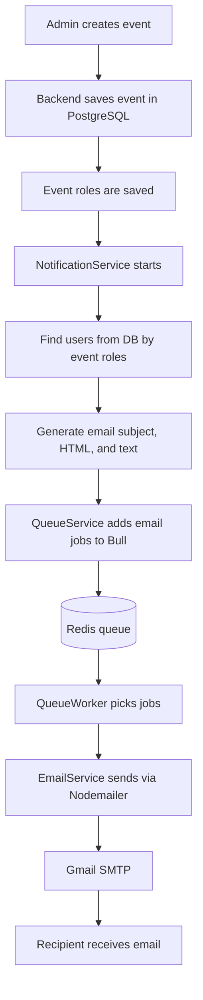
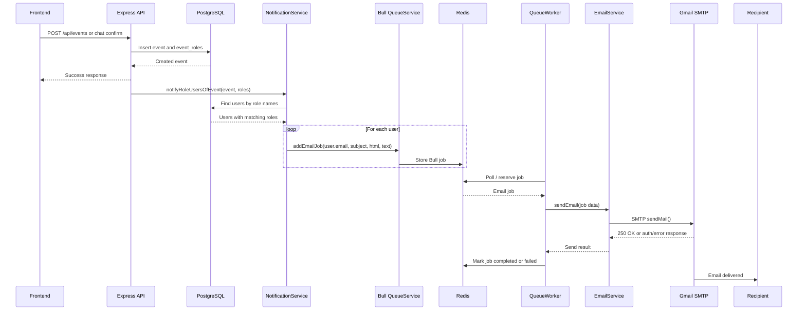
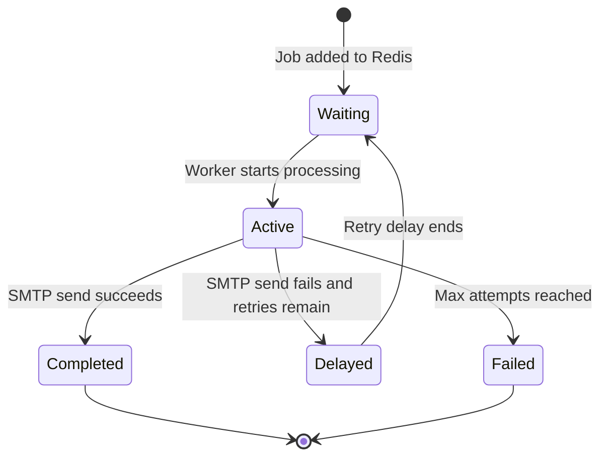

# Redis Email Notification Flow

This document explains how event notification emails work in this project using Redis, Bull queue, Nodemailer, and Gmail SMTP.

## Purpose

When an event is created, the backend should notify users whose roles match the event roles. For example, if an event is created with roles `Admin` and `Manager`, the system finds all database users with those roles and sends each user an email.

The email is not sent directly inside the event creation request. Instead, it is added to a Redis-backed queue and processed in the background.

## Main Components

| Component | File | Responsibility |
|---|---|---|
| Event controller | `backend/controllers/eventController.js` | Creates events and triggers notifications |
| Chat controller | `backend/controllers/chatController.js` | Creates events from chat and triggers notifications |
| Notification service | `backend/services/notificationService.js` | Finds users by role, builds email content, queues jobs |
| Queue service | `backend/services/queueService.js` | Creates Bull queue and stores jobs in Redis |
| Queue worker | `backend/services/queueWorker.js` | Reads jobs from Redis and sends emails |
| Email service | `backend/services/emailService.js` | Sends email through Nodemailer SMTP |
| Email config | `backend/constants/emailConfig.js` | Reads email, Redis, retry, and feature settings |
| Redis | Upstash Redis / local Redis | Stores pending, active, completed, failed jobs |
| SMTP provider | Gmail SMTP | Delivers the email |

## High-Level Flow



## Detailed Sequence



## Why Redis Is Used

Redis is used as durable queue storage for Bull. This gives the app:

- Non-blocking event creation: the event API returns quickly.
- Retry support: failed jobs are retried automatically.
- Persistence: queued jobs survive backend restarts.
- Background processing: email sending is handled by a worker.
- Monitoring: queue counts can show waiting, active, completed, failed, and delayed jobs.

## Important Environment Variables

```env
EMAIL_NOTIFICATIONS_ENABLED=true
EMAIL_USE_QUEUE=true

SMTP_HOST=smtp.gmail.com
SMTP_PORT=587
SMTP_SECURE=false
SMTP_USER=season.nep@gmail.com
SMTP_PASS=your_gmail_app_password
EMAIL_FROM_ADDRESS=season.nep@gmail.com
EMAIL_FROM_NAME="Event Management System"

REDIS_HOST=moving-cricket-117073.upstash.io
REDIS_PORT=6379
REDIS_PASSWORD=your_redis_password
REDIS_TLS=true
REDIS_TLS_REJECT_UNAUTHORIZED=false
```

## Test Email Mode

The project supports a local safety mode:

```env
TEST_EMAIL_MODE=true
TEST_EMAIL_ADDRESS=season.nep@gmail.com
```

When `TEST_EMAIL_MODE=true`, the system still fetches the real users from the database, but all emails are redirected to `TEST_EMAIL_ADDRESS`.

Example:

```text
Database recipient: manager@example.com
Actual sent recipient: season.nep@gmail.com
```

Use this when testing so real users do not receive accidental emails.

To send to the actual database users, use:

```env
TEST_EMAIL_MODE=false
```

Then `TEST_EMAIL_ADDRESS` is ignored.

## Role-Based Recipient Logic

Emails are sent based on the roles selected for the event.

Example event roles:

```text
Roles: Admin, Manager
```

The notification service calls:

```js
userRepository.getUsersByRoleNamesForNotification(['Admin', 'Manager'])
```

This fetches users from the `users` table joined with the `roles` table. Every matching user with an email address gets an email job.

## Queue Job Lifecycle



Default behavior from `emailConfig.js`:

- Max attempts: `3`
- Backoff: exponential
- Initial retry delay: `5000ms`
- Job timeout: `30000ms`
- Completed jobs are removed
- Failed jobs are kept for inspection

## What Happens On Success

If Gmail accepts the email, logs look like:

```text
[QueueWorker] Processing email job
[EmailService] Email sent successfully
[QueueWorker] Job completed
[EmailQueue] Job completed
SMTP response: 250 2.0.0 OK
```

The queue job is marked completed in Redis.

If email tracking is configured, the `email_notifications` table can also be updated to `sent`.

## What Happens On Failure

If SMTP credentials are wrong, Gmail may return:

```text
535-5.7.8 Username and Password not accepted
```

If Gmail requires an app password, it may return:

```text
534-5.7.9 Application-specific password required
```

Bull retries the job. After all attempts fail, the job is moved to the failed queue.

## Common Problems And Fixes

### Email Not Received

Check these first:

```env
EMAIL_NOTIFICATIONS_ENABLED=true
EMAIL_USE_QUEUE=true
```

Then decide recipient mode:

```env
# Send to real DB users
TEST_EMAIL_MODE=false
```

or:

```env
# Redirect all emails to one test inbox
TEST_EMAIL_MODE=true
TEST_EMAIL_ADDRESS=your-test-email@gmail.com
```

Also check spam/promotions inbox.

### Gmail Authentication Error

Use a Gmail App Password, not your normal Gmail password:

```env
SMTP_USER=yourgmail@gmail.com
SMTP_PASS=your_16_character_app_password
EMAIL_FROM_ADDRESS=yourgmail@gmail.com
```

The Gmail account must have 2-Step Verification enabled to create an app password.

### Queue Jobs Stay Pending

This usually means no worker is running, or a stale worker is consuming jobs incorrectly.

Restart the backend:

```powershell
cd backend
node server.js
```

The server startup initializes:

1. Queue service
2. Email service
3. Queue worker
4. Notification service repositories

### Duplicate Workers

If multiple old `node server.js` processes are running, stale workers may consume jobs with old `.env` values.

Check Node processes on Windows:

```powershell
Get-CimInstance Win32_Process |
  Where-Object { $_.Name -eq 'node.exe' -and $_.CommandLine -match 'server\.js|nodemon' } |
  Select-Object ProcessId,CommandLine
```

Stop duplicates if needed:

```powershell
Stop-Process -Id <process_id> -Force
```

Then start one clean backend process.

## Useful Test Commands

### Test Redis Connection

```powershell
node backend\test-redis.js
```

Expected:

```text
PING -> PONG
```

### Test SMTP Directly

```powershell
node backend\test-send-email.js
```

This bypasses Redis and checks only Gmail SMTP.

### Clear Queue Jobs

Use carefully in local testing:

```powershell
node -e "require('./backend/config/env'); const q=require('./backend/services/queueService'); (async()=>{ await q.initialize(); console.log('Before:', await q.getMetrics()); await q.clearQueue(); console.log('After:', await q.getMetrics()); await q.shutdown(); })().catch(e=>{console.error(e); process.exit(1);});"
```

This clears waiting, completed, and failed Bull jobs from Redis.

## Example Event Notification Scenario

Event created:

```text
Event Name: Database Email Delivery Test
Roles: Admin, Manager
```

Database users:

```text
season.it95@gmail.com  Admin
manager@example.com    Manager
viewer@example.com     Viewer
```

With `TEST_EMAIL_MODE=false`, emails go to:

```text
season.it95@gmail.com
manager@example.com
```

With `TEST_EMAIL_MODE=true` and:

```env
TEST_EMAIL_ADDRESS=season.nep@gmail.com
```

both notification emails are redirected to:

```text
season.nep@gmail.com
```

## Summary

The Redis email flow is:

```text
Create event
→ Save event and roles
→ Find users by selected roles
→ Create one email job per user
→ Store jobs in Redis using Bull
→ Queue worker consumes jobs
→ Nodemailer sends through Gmail SMTP
→ Job is marked completed or failed
```

This design keeps event creation fast, supports retries, and makes email delivery easier to monitor and debug.
